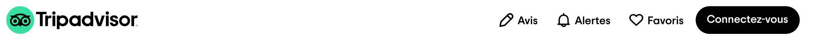
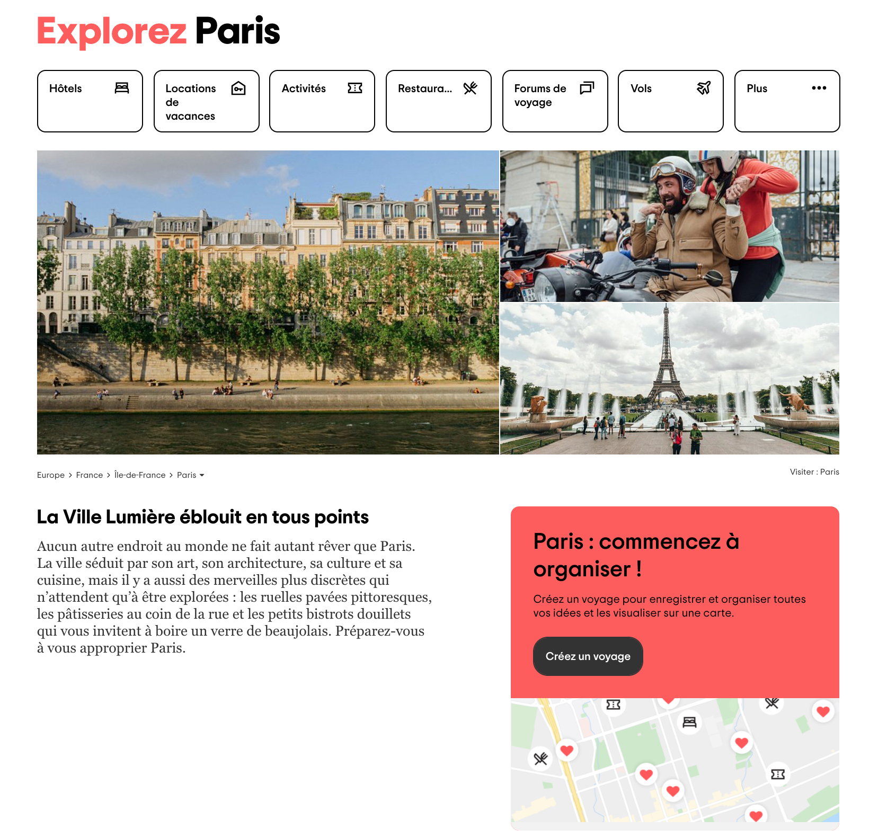
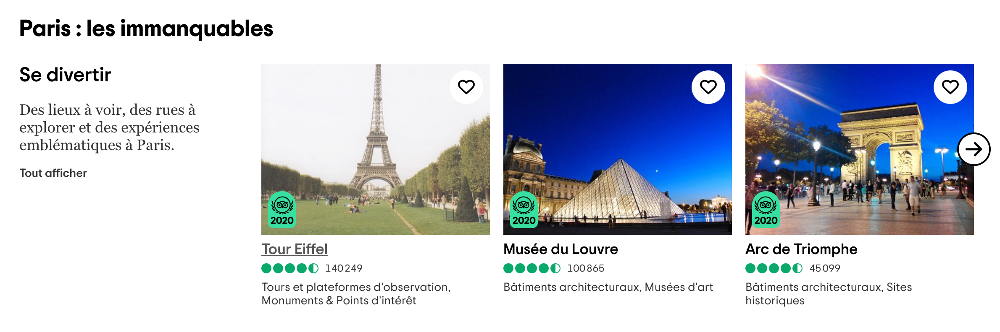
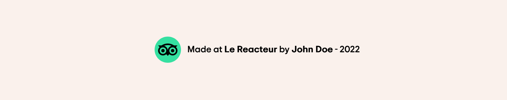

# TripAdvisor

Lien ➡️ [TripAdvisor réplique](https://antancelin.github.io/TripAdvisor-LeReacteur/)

## TripAdvisor - Partie 1

Pour réaliser cette première partie de l'exercice, référez-vous régulièrement à [cette page](https://tripadvisor-lereacteur.netlify.app/).

Pour cette partie de l'exercice, vous devrez reproduire :

### 1 - Le **'header'**

- le logo TripAdvisor à gauche
- le menu à droite avec les icônes (**'i'**) et les textes (Avis, Alertes, Favoris), ainsi que le **'button'** : "Connectez-vous".
- le menu, ainsi que le bouton, peuvent être réunis dans une balise **'nav'**.

 

### 2 - Le bloc sous le **'header'**

 
Ce bloc est composé, de haut en bas :

- d'un **'h1'** : utilisez une balise **'span'** afin d'attribuer une couleur spécifique au premier mot de ce titre
- d'une **'nav'** : les 7 éléments occupent toute la largeur du bloc parent et sont tous de la même taille (pensez à la propriété CSS flex : 1)
- de photos disposées en 2 colonnes : utilisez des balises **'img'** afin d'intégrer les photos à votre site.
- d'une deuxième **'nav'** sous les photos
- d'un bloc constitué de 2 colonnes : une première colonne composée d'un **'h2'** et d'un texte, une deuxième colonne composée d'un **'h3'**, d'un texte, d'un bouton et d'une image ([que vous pouvez télécharger ici](https://res.cloudinary.com/lereacteur-apollo/image/upload/v1650304986/apollo/lereacteur/Integration/TripAdvisor/maps_cnuhsr.png))

 

### 🖊 Fonts de TripAdvisor

Pensez à récupérer les polices de caractères utilisées sur TripAdvisor (voir cours "Utiliser une police de caractère").

### Bonus 🚀

Changez les styles de certains éléments lorsque l'utilisateur passe la souris dessus (changement de couleurs, apparition de bordures, etc). Pour cela, vous devrez utiliser une **pseudo-classe** : rendez-vous dans le cours ou faites la recherche suivante: "CSS hover".

Concernant l'opacité des couleurs ou des photos, vous pouvez utiliser :

- la propriété CSS opacity (pour en savoir plus, rendez-vous sur ce lien)
- ou bien le **code rgba** d'une couleur (pour en savoir plus, rendez-vous sur ce lien)

## TripAdvisor - Partie 2

L'exercice continue. Référez-vous régulièrement à [cette page](https://tripadvisor-lereacteur.netlify.app/).

Pour cette deuxième partie de l'exercice, vous devrez reproduire :

### 1 - La **'section'** "Paris : les immanquables"

 

Cette section est composée de 3 blocs qui se répètent, eux-mêmes composés de 2 colonnes. La 1ère colonne contient des textes et un bouton "Tout afficher", la deuxième colonne est un **carrousel de photos**. Sur chaque photo, est positionné un cercle avec un coeur au centre, ainsi que le logo TripAdvisor : vous pouvez utiliser la propriété CSS **position : absolute** pour positionner le cercle et le logo sur la photo.

⚠️ Les flèches qui apparaissent au moment du scroll **ne sont pas à réaliser**.

### 2 - Toutes les autres sections

... ou du moins, autant de sections que vous le pouvez 😉

### 3 - Le **'footer'**

Vous pouvez réaliser un footer simplifié contenant seulement le mini logo de TripAdvisor et une ligne de ce type : "Made at Le Reacteur by John Doe - 2022"

- où "Le Reacteur" serait un lien vers le site du Reacteur
- et où "John Doe" serait un lien vers votre GitHub ou votre LinkedIn.

Exemple possible :

 

### Bonus 🚀

- Rendez-vous sur la page d'accueil de TripAdvisor afin de réaliser le même **'header'**. Pour cela, utilisez la propriété CSS **position : fixed**. Remarquez l'apparition d'une bordure basse grise lors du scroll : celle-ci est gérée grâce à du JavaScript. Nous verrons prochainement comment la réaliser.

- Cachez la barre de défilement dans vos caroussels de photos. Pour cela, vous pouvez faire la recherche CSS suivante : "hide scroll bar CSS".
